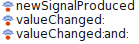

# Signals [](http://travis-ci.org/hpi-swa/signals)

A simple callback is a function call that is performed when another action took place. Normally, callback can be registered to an object and will be processed by that object whenever the time is right. There are several ways to implement such callbacks. Some are more general, others only apply to a subset of possible actions in the system. This *Signals* implementation tries to be usable in all cases but adds one or another constraint to keep code that uses signals readable.

The signals mechanism was inspired by the signals/slots concept of the [Qt Framework](http://qt-project.org/).

1. [Terms](#terms)
1. [Implementing Signals](#implementing-signals)
1. [Basic Connectinos](#basic-connections)
1. [Basic Signal Processing](#basic-signal-processing)
1. [Arguments and Patterns](#arguments-and-patterns)
1. [Disconnection](#disconnection)
1. [Using Processes](#using-processes)
1. [Awareness](#awareness)
1. [Advanced Usage](#advanced-usage)


## Terms

A *signal* is a method that can be called to trigger a callback. Then the signal will be emitted.

A *callback* is the method that is called or the process that is involved in performing this method call in response to an emitted signal.

A *connection* is a pair of signal and callback. The pair is used to lookup all callbacks whenever a signal is emitted. A signal can have multiple connections.

## Implementing Signals

A signal is an object's method that is able to trigger callbacks. It is implemented like this:

```Smalltalk
MyCounter>>valueChanged: newValue
   self emit.
```
Each signal can have an arbitrary number of arguments. The emit-call triggers the callback. In this way, any method could be used as a signal. This could be very confusing for the developer, therefore it is not recommended. Calling `self emit` not inside a method context but a block context works as well.

Obviously, a signal is emitted by calling the method that is meant to be the signal:
```Smalltalk
self valueChanged: 42.
```
You **must not** emit an object's signal from the outside. The following fails if not executed within the same instance as `myCounter`:
```Smalltalk
myCounter valueChanged: 42.
```
One could argue that this is an unnecessary constraint, but it is the idea of the signals, that an object decides itself when a signal is emitted. Allowing the signal sending from everywhere could lead to less readable code.

See the [advanced usage] (#advanced-usage) section and read about [public signals] (#public-signals) if you want to bypass this constraint for some reason.

## Basic Connections

The simplest form of a connection is created from within the UI process of Squeak, e.g., using the workspace, in the following way:
```Smalltalk
self
   connect: myCounter
   signal: #valueChanged: 
   to: Transcript 
   selector: #show:.
```
This more or less mediator approach can be changed if an object itself connects to a signal:
```Smalltalk
self
   connect: myCounter
   signal: #valueChanged: 
   toSelector: #show:.
```
**Note on garbage collection:** You need to store a reference to the receiver of the callback. Otherwise the garbage collector will collect the receiver and the connection is lost.

## Basic Signal Processing

In the simplest way, a signal is emitted from within the UI process of Squeak, e.g., in response to a Morphic `mouseDown:` event:
```Smalltalk
"The signal."
MyMorph>>mouseDownReceived: evt
   self emit.
   
"The default event handling routine in Morphic."
MyMorph>>mouseDown: evt
   self mouseDownReceived: evt.
```
Having this, the signal is processed synchronously and blocking, which means that all callbacks were made after returning from the call that emitted the signal.

## Arguments and Patterns

Each callback should expect at most arguments as the signal contains. By default, trailing arguments will be truncated and ignored:
```Smalltalk
"Works."
self connect: s signal: #a: toSelector: #b:.
"Works. Auto-truncate."
self connect: s signal: #a: toSelector: #c.
"Does not work."
self connect: s signal: #a toSelector: #b:.
```
It is possible to choose and reorder specific arguments from the signal with a pattern. A pattern is an array of numbers that maps argument positions. It must have exactly as many elements as the callback needs:
```Smalltalk
self
   connect: aSender
   signal: #a:b:c:
   toSelector: #d:e:f:
   pattern: #(3 1 2). "c->d, a->e, b->f"
   
self
   connect: aSender
   signal: #a:b:c:
   toSelector: #d:e:f:
   pattern: #(4 1). "Error!"
```
The automatic truncation can be used to avoid patterns like `#(1 2)` or `#()`. Arguments can be duplicated, i.e., `#(1 1)`.

## Disconnection

A connection can be removed from the sender:
```Smalltalk
self "the sender"
   disconnectSignal: #valueChanged:
   from: aReceiver
   selector: #processValue:.
```
You can also remove all connections from a specific receiver, all connections from a specific signal and any connection that was ever created.

Although, connections will be destroyed if either sender or receiver is deleted automatically, sometimes it could be useful to disconnect a signal to avoid endless loops.

## Using Processes

The connection and disconnection of signals is thread-safe.

Signals can be emitted from within any Squeak process. Normally, the creator of a connection should not bother where the signal is emitted but where the callback is processed to avoid considering thread-safety of involved data structures.

When creating a connection from within the Squeak UI process, callbacks will be processed within that process no matter where the signal was emitted. This is a special case of so called *queued connections*. 

### Queued Connections

Sometimes it is necessary to specify the process that is involved during signal processing. Except for the UI process, any connection made from within any other process will be handled in the process where the signal is emitted. This could lead to unexpected behavior if all involved data structures are not thread-safe!
```Smalltalk
"Here: Make you data structures thread-safe!"
[anObject
   connect: myCounter
   signal: #valueChanged:
   toSelector: #processValue:] fork.
```
To encounter this problem, connections can be queued:
```Smalltalk
Transcript
   connect: myCounter
   signal: #valueChanged:
   toSelector: #show:
   queue: aSharedQueue.
```
Using a queue, an emitted signal causes the queue to be filled with the callbacks stored into blocks that have to be evaluated by a process frequently.

The Squeak UI process has such a queue already that will be processed in the main world cycle frequently: `WorldState >> #deferredUIMessages`. Using this, basic connections from within the UI process will be queued if the signal is emitted from within any other process than the UI process automatically. Otherwise they are processed synchronously and blocking.

Any queued connection can be blocking which means that the signal emitting process will be suspended until the callback waiting in the queue is processed:
```Smalltalk
Transcript
   connect: myCounter
   signal: #valueChanged:
   toSelector: #show:
   queue: aSharedQueue
   blocking: true.
```
Of course, anyone can resume a suspended process in Squeak, but this implementation of blocking connections was quite simple and should work for many cases.

### Avoiding Deadlocks

When working with queued connections, deadlocks can appear, e.g., if a process waits for a signal to be processed by the same process that normally looks for the queue frequently. This can happen especially in the UI process and fixed as follows:
```Smalltalk
[self signalWasSent "non-blocking"]
   whileFalse: [
      WorldState deferredUIMessages next value "blocking"].
```
This approach works with any queue. It is similar to `processEvents()` in the Qt Framework. In Squeak, the whole world can be kept responsive by calling `World >> #doOneCycle` frequently.

If you create a blocking connection and a signal is emitted with a queued callback to be processed in the same process, nothing will happen until the process is resumed from the outside. You should not do that.

### Waiting for Signals

The `SignalSpy` can be used to wait for signals explicitly. Normally, it should be used in tests and not in the application itself:
```Smalltalk
spy := SignalSpy
   onSender: aSender
   signal: #signalEmitted.
signal := spy waitForNextSignal.
```
The signal spy catches all registered signals emitted from any process. Wait operations are blocking so be sure that the signals are emitted in another process. You can wait for a specific signal using `#waitForSignal:`.

If you want to test for some properties of the next signal besides its name, use `#waitForNextSignalSatisfying:`:
```Smalltalk
spy waitForNextSignalSatisfying: [:signal | |arguments|
   arguments := signal second.
   arguments first = #foobar].
```
The structre stored by the `SignalSpy` is an array with two fields: signal name and signal arguments.

## Awareness

There is an extension to the [OmniBrowser Framework](http://pharo.gemtalksystems.com/book/PharoTools/OmniBrowser/) that shows a small icon in front of signals in the message list:



Trying to load the Signals package into a Squeak image without OmniBrowser installed results in a warning that can be ignored safely.

A connection creation needs symbols - one for the signal and one for the callback. Therefore it is possible to use the Squeak *Browse Senders* way to investigate them:
```Smalltalk
self
   connect: aSender
   signal: #valueChanged: "Will be found."
   to: aReceiver
   selector: #value:. "Will be found."
```
Unfortunately the signal emitting place, which is just a message send, and other message sends that are not callbacks will be found as well. To solve this problem, some reflective methods were added to `SystemNavigation` to allow browsing for connections and signal sends:
```Smalltalk
SystemNavigation default
   allConnectionsOn: #valueChanged:
   from: aClass. "Here is the connection code
                 somewhere."
   
SystemNavigation default
   allSignalEmitsFrom: aSenderClass
   signal: #valueChanged:.
```

## Advanced Usage

### Public Signals

To bypass the constraint that a signal cannot be emitted from the outside but must be emitted from the instance that has the signal, you can use *public signals*. These types of signals just do not have that constraint and are implemented as the following:
```Smalltalk
MyCounter>>valueChanged: newValue
   self emitAlways.
```
Use them with caution because they could lead to less readable code. 

### Connect Signal to Signal

Signals are just normal methods. Therefore they can be used as callbacks as well. If the receiver is not identical to the sender of the signal you need to use a *public signal* as target:
```Smalltalk
self
   connect: aSender
   signal: #valueChanged "Signal #1"
   toSelector: #switchToggled. "Signal #2 - Has to be public if sender <> receiver!"
```

### Automatic Connections

It is possible to create methods that look like they want to be connected to a senders signal:
```Smalltalk
MyDialog>>onNameEditTextChanged: aText
   self availabilityLabel contents: 
      (self checkAvailability: aText).
```
Such a method can benefit from its signature if there is an instance variable named `nameEdit` which sends the signal `#textChanged:`. Automatic connections can be created from such patterns after the referenced instance variables were initialized:
```Smalltalk
MyDialog>>initialize
   super initialize.
   nameEdit := MyNameEdit new.
   self createAutoSignalConnections.
```
If the sender does not send this signal the connection will silently not be created.

### Wrapped Signals

Sometimes it could be useful to re-use a arbitrary message that an object understands as a signal, e.g., to be notified if a morph changes its position without having to subclass that morph like this:
```Smalltalk
MyMorph>>position: aPosition
   super position: aPosition.
   self emitAlways. "Would have to be a public signal."
```
Or like this:
```Smalltalk
MyMorph>>position: aPosition
   super position: aPosition.
   self positionChanged: aPosition.

MyMorph>>positionChanged: newPosition
   self emit.
```
To avoid this, it is possible to use **any message** as a signal as long has the sub-package *SI-Wrapper* is installed which requires [Method Wrappers] (http://www.laputan.org/brant/brant.html) as well:
```Smalltalk
"Installs a method wrapper on #position:."
self connect: aMorph signal: #position: to: Transcript selector: #show:.
```
There will be only one method wrapper installed for each message that will be used in a connection for the first time. If no connections use that message as a signal, the wrapper will be removed from that message.

### Advanced Patterns

It is possible to access the sender of a signal itself and use it as an argument for the receiver. This is achieved with a `0` in the pattern and can reduce the number of needed methods because the control flow may consider the sender, e.g. different actions are triggered and show themselves on a log:
```Smalltalk
self
   connect: anAction
   signal: #triggered
   toSelector: #logAction:
   pattern: #(0).

self
   connect: anotherAction
   signal: #triggered
   toSelector: #logAction:
   pattern: #(0).
```
Patterns can have default values that will be send if the signal is processed:
```Smalltalk
"self changed: #counterValue."
self
   connect: myCounter
   signal: #valueChanged:
   toSelector: #changed:
   pattern: #(=counterValue).
```
You can send whole objects as default value:
```Smalltalk
self
   connect: myCounter
   signal: #valueChanged:
   toSelector: #addMorphBack:
   pattern: {#=. Morph new}.
```
Patterns can mix index references to the sender's arguments and default values: `#(2 1 =foobar)`. As you see, the magic happens just because of the escape symbol `#=`. Every value that comes after it, will be treated as itsself and not as an index reference.

**Hint:** If you store an object into a pattern, the garbage collector will collect that object if it is not referenced somewhere else. In that case, `nil` will be supplied as argument. 
